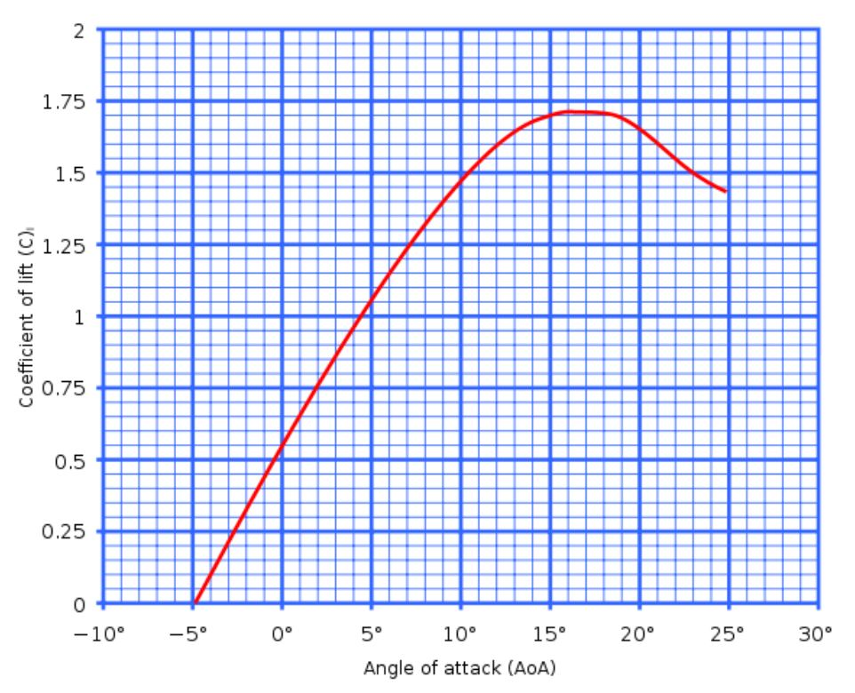
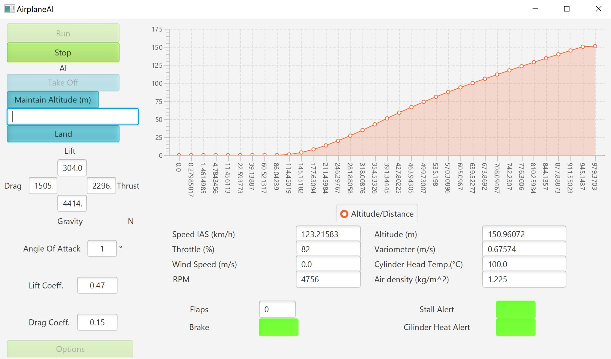
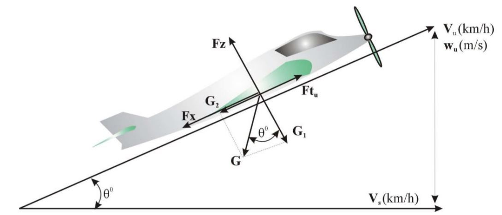
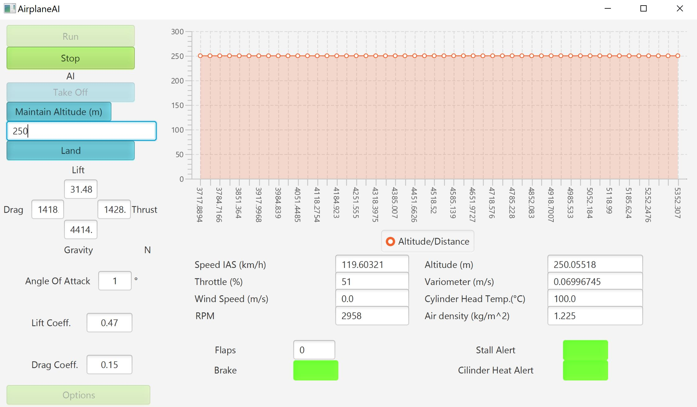
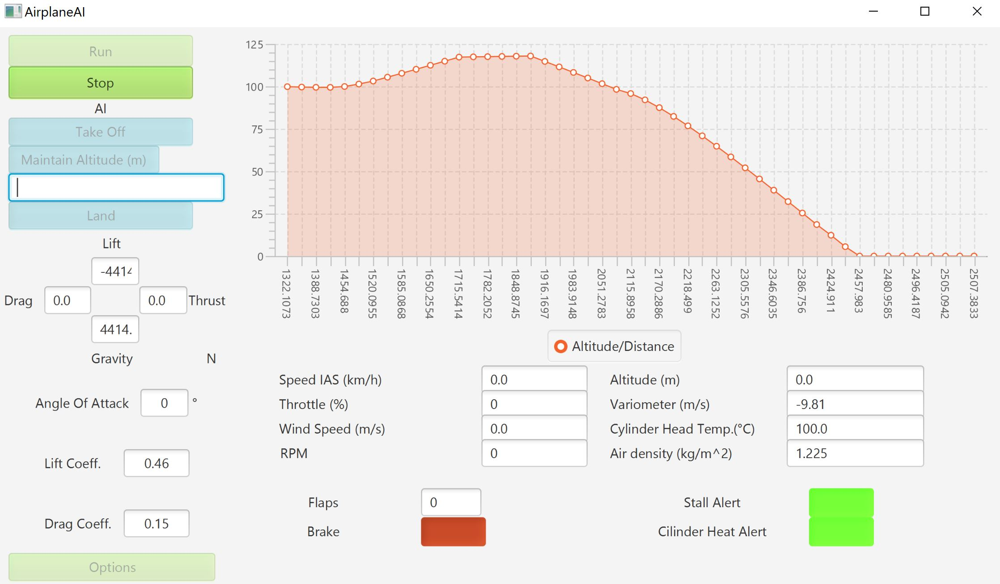
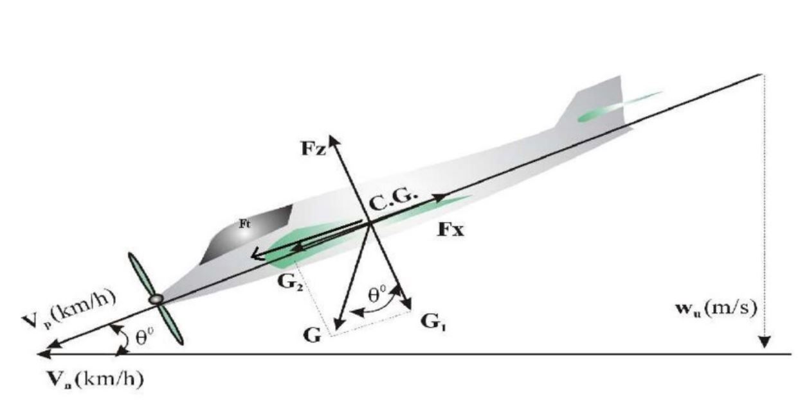

# Autonomous piloting system template for ultralights

This personal project represents an autopilot template for ultralight aircrafts, simulating the flight of an Aerostar Festival R40F  on the transversal axis replicating the take-off, landing and maintaining altitude procedures using the basic principles of flight.

## Principles of flight

The four main which act on an airplane are the **lift**, **gravity**,  **thrust** and **drag**. When the plane is in unaccelerated straight flight the lift is equal to the weight and the thrust to the drag. Any small difference in this balance creates an acceleration. In order to safely climb, maintain altitude or descend these forces need to have a certain amount of intensity so as to complete the maneuver in a smooth and efficient way.

     rho - density of air
     V - air speed
     S - wing surface area
     Cz - lift coefficient
     
The lift coefficeint is in relation with the wing angle of attack 

     rho - density of air
     V - air speed
     S - wing surface area
     Cx - drag coefficient
     

     m - mass
     g - gravitational acceleration (used 9.81 m/s^2)
     
 Thrust was taken as a procent (0-100%) of a constant value (maxThrust)
     
## Take off
1. Flaps lowered to the first position then rising the speed sequentially to 100%.
2. Accelerating until the plane passes the stall speed and it's safe to liftoff.
3. Rising the pitch and leaving the ground.
4. Lowering the pitch to 0 degrees in order to gain more speed for smoother and safer climbing.
5. Once the plane reaches 120 km/h it will start climbing again to 150 m
6. When the plane reaches 150 m take off will disengage because the plane finished this stage and reached a safe altitude.
7. Until further notice, the plane will hold 150 m at 120 km/h IAS ( or other altitude set as the take off safe altitude ).

    G - weight
    Fz - lift force
    Fx - drag force
    Ft - traction force
    Theta - climb angle
    S - surface of the wing
    rho - air density
    Cz - drag coefficient
    Cx - lift coefficient
   
   
   
   
   
## Maintaining altitude

• If the desired altitude is the current altitude the plane will maintain the level set at 120 km/h with an angle of attack near 0. Further minor corrections will take place because it’s the ideal „lift equals gravity" principle is hard to achieve.
• If the plane is above or below the specified altitude it will climb or descent at a maximum angle of 5 degrees and minimum angle of -5 degrees for a smooth operation
• Once the plane is near the desired altitude the pitch will tighten to prevent a pendulum effect when it reaches the altitude.

## Landing

1. The pitch is lowered relative to the altitude, more accentuated if it is al a higher altitude.
2. Once it reaches 250m it will lower the flaps to the first position.
3. At 100m the second position of flaps will be lowered.
4. The throttle will be set to 0.
5. When the plane reaches the ground it will brake to stop its motion.

    G - weight
    Fz - lift force
    Fx - drag force
    Ft - traction force
    Theta - climb angle
    S - surface of the wing
    rho - air density
    Cz - drag coefficient
    Cx - lift coefficient
   
 
   
   
   
## Options & Logs
By default the parameters are based on the Aerostar Festival R40F aircraft and the standard atmosphere at sea level.
The following parameters can be modified from the options tab:
	-Air density (default: 1.225kg/m^3)
	-Wind speed (default:0 m/s)
	-Wing lift surface  (default:13.99 m^2)
	-Maximum cilinder temperature (default:130 C)
	-Autopilot take off safe altitude  (default: 250m)
	
After each flight logs are stored containing:
IAS, Altitude, Distance, Angle of Attack, Flaps, RPM, Throttle, Lift, Gravity, Drag, Thrust, Lift Coeff, Drag Coeff, Air Density, Wind, Cylinder Temp, Stall Alert, Brake.
	
Notes:
All measurements made in SI units (except temperature which is in Celsius).
Image showing lift coefficient in relation with wing pitch-[https://en.wikipedia.org/wiki/Angle_of_attack](https://en.wikipedia.org/wiki/Angle_of_attack)
Images showing forces at take off and landing are from "Chestionar de examinare – eliberare / revalidare / reînnoire / recunoaştere / echivalare licenţă  de pilot de Aeronave Ultrauşoare Motorizate – Aeroclubul României"

For any additional information, contact me at horigovor96@gmail.com
